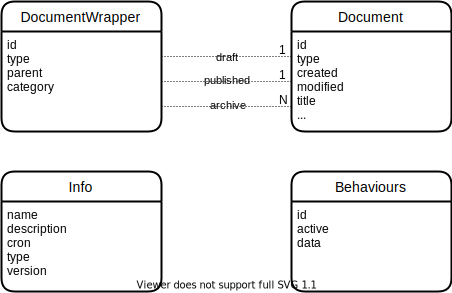
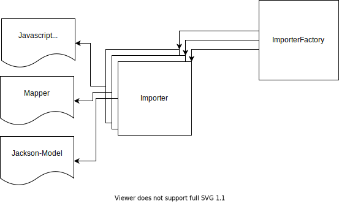

= IGE-NG Software Documentation
:source-highlighter: highlight.js
:highlightjs-languages: kotlin
:toc: left
:toclevels: 3
:stylesheet: ingrid.css

== Introduction

== Architecture

=== Spring Boot

==== Profiles

Several profiles can be activated via Spring.
With each activated profile a separate configuration file can be used, which has the format `application-<profile>.properties` The following list explains each profile:

[cols="1,2"]
|===
|Profile |Description
| dev 
| Contains configuration used during development for correct setup.
It also disables Keycloak.

| elasticsearch 
| Activate export to Elasticsearch during publishing and indexing 

| ibus | Use configuation for an iBus

| mcloud | Activates importer, exporter and datatypes for the mCLOUD-Profile

| uvp | Support for management of UVP documents

| ingrid | Support for management of Geo-Datasets and Services with export to ISO-19139 format

| ogc-api | Support for OGC API for Records

| csw-t | Support for CSW Transactions

|===

==== Dependency Injection

=== Model View Controller

==== REST API / Swagger

http://localhost:8550/v3/api-docs

==== Controller / Services

Services are annotated with `@Service` or `@Component` which makes them available to spring's dependency injection.
Instances are singletons by default.
A class that requires a service will typically access it through an `@Autowired` member variable.

==== Persistence

The persistence layer of IGE Server consists of the following main *interfaces* (located in the `de.ingrid.igeserver.persistence` package and it's sub-packages):

* `Repositories` define the access layer to the database.
These are offered by Spring Data and can be easily extended with additional functionality, often without writing any SQL.
* `EntityType` is the base interface for all *document types*.
This could be general domain specific types like
`AddressType` or profile specific types like `MCloudType`.
Services will use these interfaces to execute additional tasks that only the document type itself knows how to handle.
If a document has references to another document or address, then it's his responsibility to handle the resolution of the references, since this data cannot be stored in a relational manner, due to the fact that each document has it's own schema.

=== Database

The database-system is https://www.postgresql.org/[PostgreSQL], which is a relational database with support for JSON fields.
Moreover it supports transaction, so that every (batch of) operation can be rolled back to the previous state.

==== Data model

All data is held in a single database.
That means that all documents of all catalogs are united in that single database.

The data model is shown here:

[plantuml]
----
@startuml

DocumentWrapper "uuid" --> Document
class DocumentWrapper {}
class Document {}

class Info {
--
name
description
cron
type
version
}
class Behaviours {
--
    id
active
data
}

@enduml
----

A `DocumentWrapper` manages different versions of a document.
A document is normally stored in the draft-field.
When it's being published it's removed from the draft-field and put into the published-field.
In case another document version has been in the published-field, it's moved to the archive-field, which can contain a number of documents.

A `Document` can be any kind of data, which has at least a title, the document type and the creation and modification date.
Since Postgres supports NoSQL, the document can be extended without any schema changes and migrations.
By just defining a new field, it's automatically stored in the document table.

The `Catalog` contains information about the catalog itself.
It can also store settings, like a time pattern for indexing.

The `Behaviour` stores the state of a behaviour, which can be changed in the catalog settings of the IGE-NG.
A behaviour can be active or inactive.
It can also contain optional parameters for more flexibility.

=== Extensions

Extensions are used to extend or alter the functionality of IGE Server without changing the core code.
For more information about the concept and implementation see the link:Extensions.adoc#_extension_points[Extensions Documentation].

IGE Server defines the following extension points:

==== Persistency

* `Pipe<PrePersistencePayload>` called *before* any of the persistence operations *create*, *update*, *publish*, *delete*
* `Pipe<PostPersistencePayload>` called *after* any of the persistence operations *create*, *update*, *publish*, *delete*
* `Pipe<PreCreatePayload>` called *before* the persistence operation *create*
* `Pipe<PostCreatePayload>` called *after* the persistence operation *create*
* `Pipe<PreUpdatePayload>` called *before* the persistence operation *update*
* `Pipe<PostUpdatePayload>` called *after* the persistence operation *update*
* `Pipe<PrePublishPayload>` called *before* the persistence operation *publish*
* `Pipe<PostPublishPayload>` called *after* the persistence operation *publish*
* `Pipe<PreDeletePayload>` called *before* the persistence operation *delete*
* `Pipe<PostDeletePayload>` called *after* the persistence operation *delete*

.Beispiel
[%collapsible]
====
[source,kotlin]
----
@Component
class DefaultUpdateValidator : Filter<PreUpdatePayload> {
  override val profiles: Array<String>?
    get() = arrayOf<String>()

  @Autowired
  private lateinit var dbService: DBApi

  override fun invoke(payload: PreUpdatePayload, context: Context): PreUpdatePayload {
    val docId = payload.document[FIELD_ID].asText();

    context.addMessage(Message(this, "Validate document data '$docId' before update"))

    // do checks

    return payload
  }
}
----

====

=== Error Handling

IGE Server defines the following *exception hierarchy*:

* `IgeException` is the base class for all exceptions that could visible to REST API clients.
It contains the following properties:

* `statusCode` The HTTP status code send to the client.
* `errorId` The unique identifier of the exception for getting detail information from the log files.
* `errorCode` A custom error code written in uppercase letters with the underscore character as word separator (e.g. `ALREADY_EXISTS`), that allows clients to identify the error cause.
* `errorText` A custom error text that could presented to the user.
Variables of the form `${variable}` will be replaced by the value of the appropriate key if present in data.
* `data` An optional key-value map used to customize the error text.
* `stackTrace` The stack trace of the exception (only if it was an unexpected exception).

  The `statusCode` value will be used as the HTTP response code, while `errorId`, `errorCode`, `errorText`, `data` and `stackTrace` will be send as JSON encoded string inside the response body.

  The following example shows how a validation error response could look like:

[source,json]
----
  {
    "errorId": "d6c386c7-5c5e-4886-aac3-d8a9ddedf625",
    "errorCode": "VALIDATION_ERROR",
    "errorText": "One or more fields are invalid: title, description.",
    "data": {
      "fields": [
        {
          "name": "title",
          "errorCode": "REQUIRED"
        },
        {
          "name": "description",
          "errorCode": "STRING_LENGTH",
          "data": {
            "min": 50,
            "max": 250
          }
        }
      ]
    }
  }
----

* `ServerException` is the base class for all exceptions that occur while processing a valid request to the REST API.

* Server exceptions have the `statusCode` value *500* if not set to more specific value of *5XX* in sub classes.
* Server exceptions will be logged with *log level ERROR*.

* `ClientException` is the base class for exceptions that are caused by invalid request to the REST API.

* Client exceptions have the `statusCode` value to *400* if not set to more specific value of *4XX* in sub classes.
* Client exceptions will be logged with *log level DEBUG*.

* All other exceptions are sub classes of either `ServerException` or `ClientException`.

All exceptions pass through `de.ingrid.igeserver.RestResponseEntityExceptionHandler` which ensures logging and the response body as described above.

The following *guidelines* should be kept in mind when handling errors:

* Exceptions should not be swallowed.
* Only logging an exception is not a good practice, since it requires monitoring of the log files to discover them.
It's better to let it pass to the client to signal that something went wrong.
* Logging and rethrowing an exception is not necessary, since _all_ exceptions are logged by the global exception handler (see above).
* Exceptions should not be handled unless it's possible to handle them in a meaningful way at that point or it's necessary to add meaningful information.
* Exceptions should be thrown instead of using `ResponseEntity.status(HttpStatus.XXX).build()` or `HttpServletResponse.sendError(HttpServletResponse.XXX, msg)`, because this will ensure the response body as described above.
* Whenever possible, information should be added to the exception that helps to analyze the cause (e.g. which record was failed to update).

=== Logging

IGE Server uses the [Log4j Framework](https://logging.apache.org/log4j/2.x/) with the Log4j Kotlin API.
The configuration is defined in the `log4j2.xml` file.

A class typically creates it's own *logger instance* using the following code

[source,kotlin]
----
private val log = logger()
----

==== Audit Log

An audit log is written for the *documentation of changes* in the application data or to *record specific interactions* with the system.
It consists of special records that answer the question _what_ was done _when_ and by _whom_.

The `de.ingrid.igeserver.services.AuditLogger` component is used to create audit log records with it's `log()` method.
It uses Log4j loggers that can be configured to log to different destinations.
The default logger's name is `audit`.

An *audit log record* consists of the following information:

* A _Category_ used to group records for filtering (e.g. _data-history_)
* An _Action_ specifying the kind of changes applied to the resource (e.g. _delete_)
* An _Actor_ executing the action (the value is usually retrieved automatically from `UserService.getCurrentPrincipal()`)
* The _Time_ when the action took place (the value is usually retrieved automatically from `DateService.now()`)
* The _Target_ of the action (e.g. the unique identifier of the data to which the changes were applied)
* The _Data_ defining the changes that were applied

A typical audit log record looks like the following:

[source,json]
----
{
  "cat": "data-history",
  "action": "delete",
  "actor": "user1",
  "time": "2020-09-07T16:02:11.618768300+02:00",
  "target": "dcf47072-d331-4a4c-bac1-3af64e9c1ea8",
  "data": {
    "_hasChildren": false,
    "_parent": null,
    "@rid": "=47:18",
    "@class": "Document",
    "_created": "2020-08-25T14:29:40.797511700+02:00",
    "@version": 1,
    "_type": "UvpDoc",
    "_id": "dcf47072-d331-4a4c-bac1-3af64e9c1ea8",
    "title": "Test",
    "_modified": "2020-08-25T14:29:40.797511700+02:00"
  }
}
----

If we need to *access the audit log* in the application, the audit log must be stored in the *database*.
This is achieved using the following *configuration*:

* Definition of the database and database table in `application.properties`:

[source,properties]
----
  audit.log.table=audit_log
----

* Configuration of a Log4j appender that writes to that database and database table (in this case an instance of `PostgreSQLAppender`):

[source,xml]
----
  <PostgreSQLAppender name="AuditLogDB" table="${spring:audit.log.table}" />
----

* Configuration of the default Log4j logger used by `AuditLogger` to use this appender:

[source,xml]
----
  <!-- audit logger -->
  <Logger name="audit" level="info" additivity="false">
    <AppenderRef ref="AuditLogDB" />
  </Logger>
----

`AuditLogger` will then be able to connect to the database and retrieve records using it's `find()` method.

==== @AuditLog annotation

A convenient way to create an audit log record each time a method is called is to use the `@AuditLog` annotation.
It creates a record with the following values:

* _Category_: The value of the `category` parameter defined in the annotation (default: _empty string_)
* _Action_: The value of the `action` parameter defined in the annotation (default: class name with the name of the annotated method appended)
* _Target_: The value of the method parameter specified in the `target` parameter, e.g. if target is `id`, the value of the `id` method parameter will become the value of _Target_ (default: _empty string_)
* _Data_ The value of the method parameter specified in the `data` parameter, e.g. if target is `document`, the value of the `document` method parameter will become the value of _Data_ (default: parameter names and values of the annotated method call in JSON notation)

_Actor_ and _Time_ are defined as usual.

NOTE: The audit log record is created *after* the method is executed which means that only _successful_ method executions are recorded.

Using the annotation *without any parameters*

[source,kotlin]
----
@AuditLog
fun updateDocument(id: String, data: JsonNode, publish: Boolean = false) {
  ...
}
----

will result in records of the following form:

[source,json]
----
{
  "cat": "",
  "action": "de.ingrid.igeserver.services.DocumentService.updateDocument",
  "actor": "user1",
  "time": "2020-09-14T17:10:06.145049500+02:00",
  "target": "",
  "data": {
    "data": "{\"title\":\"Test\",\"_id\":\"bd485713-0aba-4140-88cb-dd37675d5973\",\"_parent\":null,\"_type\":\"UvpDoc\",\"_created\":\"2020-09-14T17:04:48.733668500+02:00\",\"_version\":1,\"description\":\"Beschreibung\",\"_modified\":\"2020-09-14T17:10:06.101057900+02:00\"}",
    "publish": "false",
    "id": "bd485713-0aba-4140-88cb-dd37675d5973"
  }
}
----

The following example will create a record similar to the *default data history log* (see below):

[source,kotlin]
----
@AuditLog(category="data-history", action="update", target="id", data="data", logger="audit.data-history")
fun updateDocument(id: String, data: JsonNode, publish: Boolean = false) {
  ...
}
----

==== Data history log

A special category of audit log records are data history records.
They are used to document changes made to the application data.
The data history log is realized in the following way:

* The `de.ingrid.igeserver.persistence.filter.persistence.DataHistoryLogger` class that is implemented as an extension (`Filter`) of the `Pipe<PostPersistencePayload>` extension point and therefor invoked after each persistence operation
* This class uses the following parameters when creating an audit log record:
* _Category_: Value of `audit.log.data-history-category` defined in `application.properties` (default: _data-history_)
* _Logger_: Value of `audit.log.data-history-logger` defined in `application.properties` (default: _audit.data-history_)

This means that data history records can be retrieved by filtering audit log records by a category value of _data-history_.
Since the logger name _audit.data-history_ is a descendent of the default audit log logger, it uses the same configuration by default (especially the same appender), but could be configured in a different way as well.
The produced records look like the example mentioned in the audit log section.

=== Profiles

A profile generally is created for every customer, who needs special requirements for entering and handling documents.

For each profile a `profile definiton file` must be implemented, which is a class extending the `CatalogProfile`-interface.

A profile definition file contains the configurations for a specific profile.
This profile contains the following information:

[cols="1,2"]
|===
|Property |Description

|identifier
|unique identifier for a profile

|name
|a proper name

|description
|describes the profiles

|facet definition for documents
|definition of filters for documents used on research page

|facet definition for addresses
|definition of filters for addresses used on research page

|definiton of catalog codelists
|additional codelists used in this profile

|definiton of catalog queries
|catalog queries for research page accessible by all users

|definition of elasticsearch mappings and settings
|used for index configuration
|===

The definition information is also used in the frontend, when creating a new catalog (to choose from a profile) or the presentation of the research page (facets / quick filters).

An example of how to add a new profile can be found in FAQ.md.

==== Document types

A profile can contain one or more document/entity types.
Each document type contains a definition of fields for the form in the frontend and a definition in the backend.
The definition in the backend should contain information about how to resolve references to other addresses/documents.

Moreover each type can control its publication and do some validations by overriding the `onPublish`-function

The form fields are defined in a JSON format and will be used by the [ngx-formly](https://formly.dev/) library.
It's also possible to add most of the validation logic within that definition.
See also FAQ.md

==== Importer

An importer is used to import a file of a defined format.
Multiple importer can be written, which can be chosen during the import process, if several importer can handle the input format.

An importer is a service which implements the interface `IgeImporter`.
With the profile annotation you can define, that the importer is only initialized when a specified profile is active.

The function `canHandleImportFile` is needed to check, if the given file can be imported by this importer.
With the given content and its content-type we should be able to determine if the importer is suitable.
If multiple importer say that they can handle the input file, then the user is presented a choice dialog, to select the correct importer.

After an importer is run, we expect to receive a JsonNode object, which is filled with data coming from the imported file.
The object should represent the JSON format, in which the document is stored in the database.

==== Exporter

An exporter is used to transform the data of a document into another format.
Multiple exporter can be written, which can be chosen during the export process in the frontend.

[plantuml]
----
@startuml
interface IgeExporter {
    run()
    toString()
    calculateFingerprint()
}
IgeExporter <|-- Exporter1

Template1 <- Exporter1
Exporter1 -> Model1

IgeExporter <|-- Exporter2
Template2 <- Exporter2
Exporter2 -> Model2

ExporterFactory "1" o-- "n" IgeExporter
@enduml
----

A profile can offer multiple export formats.
You need to create a new service, which should only be active if the profile is.
This service must implement the interface `IgeExporter` and return a typeInfo with a description of the exporter.
This is also used in the frontend, to choose from a collection of exporters.

It's recommended to use the https://jte.gg/[Java Template Engine (jte)] for creating the exported document.
In combination with a model-class, the template can be easily filled with all the information.
When the model-class implements one of the provided interfaces, e.g. `DCAT` then the same template can be even used for multiple document types.

An exporter is also used for indexing where the document will be converted to a JSON format which is then stored in an Elasticsearch index.
Since the index itself can have a configuration on its own, you can define a settings and mapping configuration for the index.
This can be defined in the profile definition file.

=== Export format

The documentation of the export format is here: link:export-format.adoc#_export_format[Definition Export format]

=== Migrations

Whenever it's necessary to update the schema of the database or do some data modifications, you are in need of a migration.
To create a new migration task you need to do the following:

* create a new service in `de.ingrid.igeserver.migrations.tasks` which extends `MigrationBase`
* set new version in `MigrationBase`-constructor
* implement `exec()`-function to run migration for each database

More information can be found in the FAQ.md.

.Beispiel
[%collapsible]
====
[source,kotlin]
----
include::../server/src/main/java/de/ingrid/igeserver/migrations/tasks/M020_AddCodelistTable.kt[lines=12..]
----
====

== Permissions

The topic about handling permissions can be found here: link:permissions.adoc#_permissions_authorisation[Permission-Documentation]

== Configuration

include::_environment.adoc[]

include::_testing.adoc[]

include::_deployment.adoc[]

include::_interfaces.adoc[]